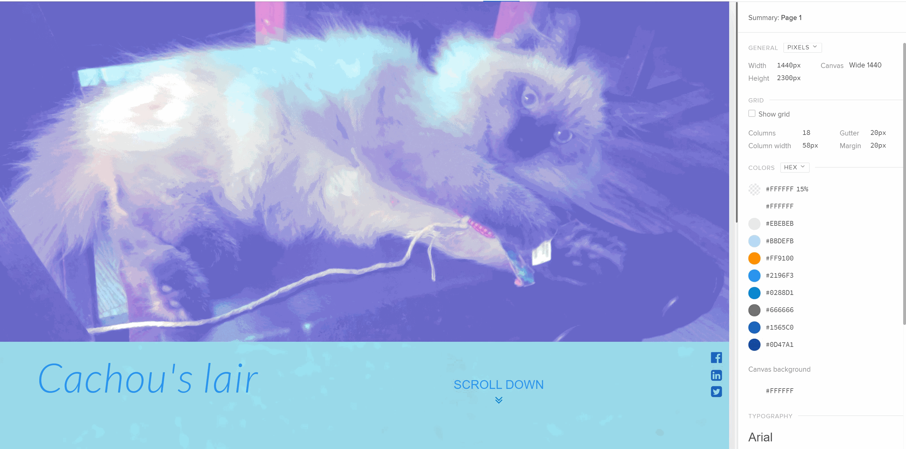
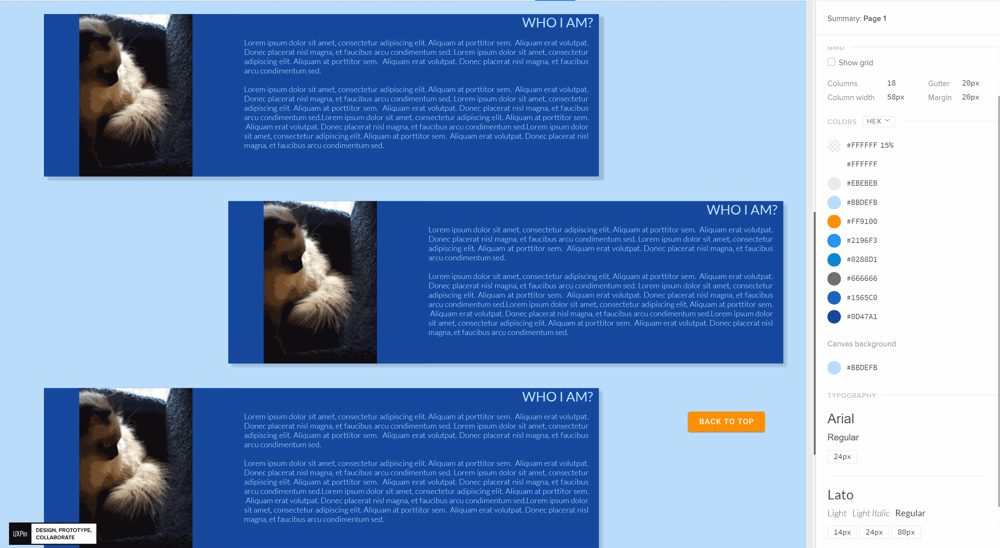
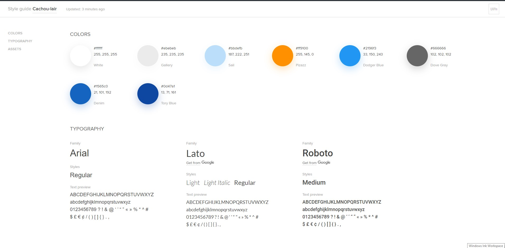

# cachou-lair

Deployed on Github, built with simple HTML and CSS

Our cat deserved a website and we spoil him. With this project, discover his life and know some more about him and his breed.

## Start

Local: Clone and open `index.html` in your preferred browser.

Deployed on Github Pages [ https://wildapt01.github.io/cachou-lair/](https://wildapt01.github.io/cachou-lair/)

## Tech stack

To keep things simple:

- HTML5
- CSS3
- Javascript ES6 (DOM manipulation)
- Animation with AOS library
- Prototyping with [UXPin](https://www.uxpin.com/)

## File structure

```
.../cachou-lair/
├── README.md
├── assets
│   ├── blue-jay.png
│   ├── cachou-7mois.png
│   ├── cachou-play.png
│   ├── cachou-sleep.png
│   ├── favicon.ico
│   ├── laying-cat.png
│   ├── neva-masquerade.png
│   ├── prototype1.png
│   ├── prototype2.png
│   ├── style-guide.png
│   └── three-cats.png
├── button-top.js
├── create-card.js
├── index.html
└── style.css

1 directory, 16 files
```

## Prototype





Style guide:



## Animation

Thanks to Michał Sajnóg for his [Animate On Scroll library](https://michalsnik.github.io/aos/) !
